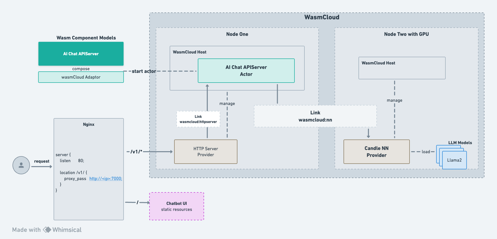

# [wasmCloud](https://github.com/wasmCloud/wasmCloud) & [wasi-nn](https://github.com/WebAssembly/wasi-nn)
wasmCloud-wasi-nn provides wasmCloud with [wasi-nn](https://github.com/WebAssembly/wasi-nn) compatibility.

The implementation of the wasi-nn capability provider is very flexible, and currently two types of providers have been implemented

* **Native OpenVINO**: This implementation is basically the same as the wasmtime implementation of [wasi-nn/openvino](https://github.com/bytecodealliance/wasmtime/blob/main/crates/wasi-nn/src/backend/openvino.rs)..

A simple demo can be seen [here](https://twitter.com/IceberGu/status/1742483365960601925), and a [more complete video](https://youtu.be/fK3DcnRe0Do) 

* **Candle based implementation**: [Candle](https://github.com/huggingface/candle) provides support for loading [many types of models](https://github.com/huggingface/candle?tab=readme-ov-file#features), e.g., **LLMs**, **Text to image Models**, **Image to text Models**, etc.

You can see a demo of Candle-based LLMs [here](https://twitter.com/IceberGu/status/1746782269870936177)

The code for providers hasn't been pushed yet, feel free to discuss with me in Slack or Issue!
